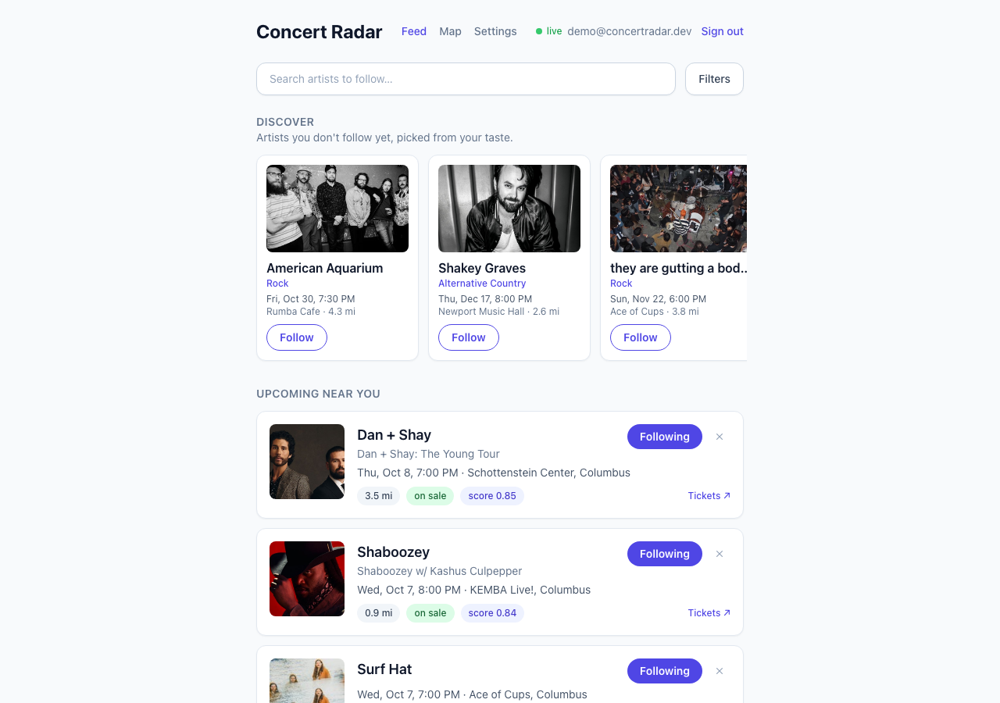
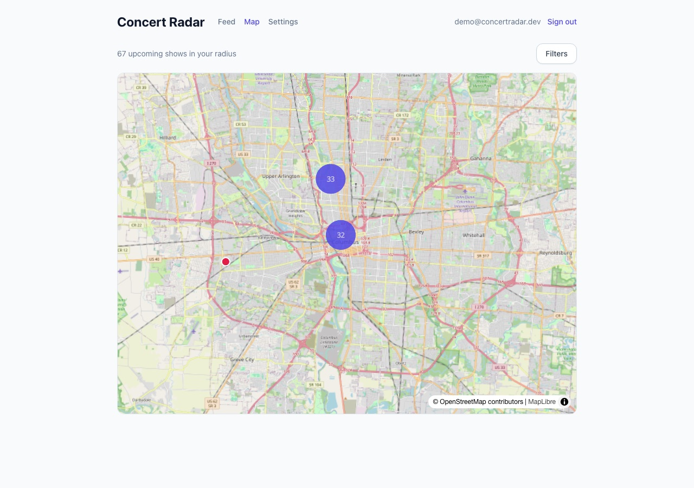
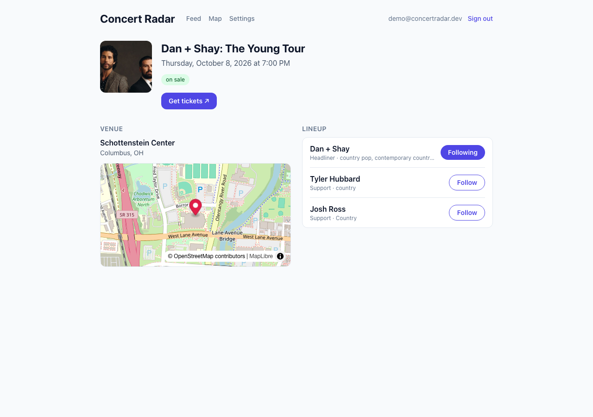
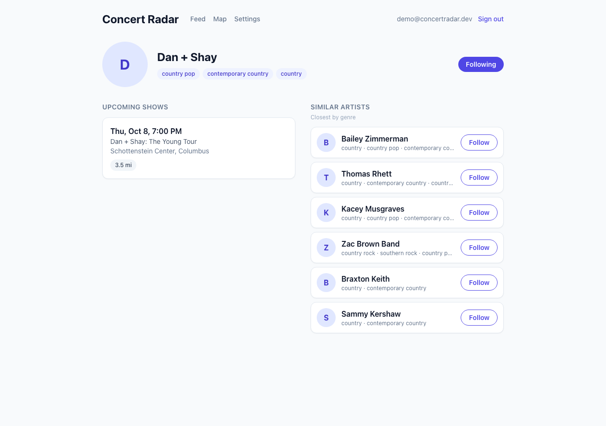
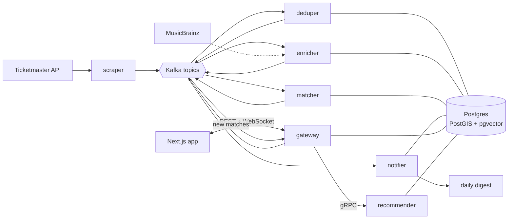
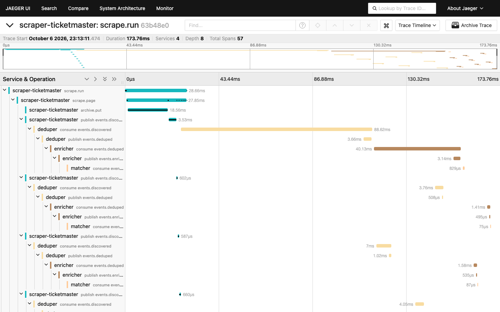

# Concert Radar

[](https://github.com/hollywood-an/concert-radar/actions/workflows/ci.yml)
[](https://github.com/hollywood-an/concert-radar/actions/workflows/deploy.yml)

Concert Radar tells you when artists you follow announce shows near you, and ranks
everything else playing nearby by how well it fits your taste. It scrapes Ticketmaster,
resolves artists against MusicBrainz, embeds their genres into a shared vector space, and
streams every new show through an event-driven pipeline to the people who should hear
about it: live in the app and in a daily email digest.



| Clustered map of every show in range | Event page | Artist page with similar artists |
|---|---|---|
|  |  |  |

## How it works



- **Seven Python microservices** (FastAPI, aiokafka, gRPC) communicate over **9 Kafka
  topics** (Redpanda) and one **gRPC** call. A batch scraper publishes shows; the **deduper**
  merges duplicate listings across sources; the **enricher** resolves artists on MusicBrainz
  and embeds their genres with `all-MiniLM-L6-v2`; the **matcher** finds who should hear
  about each show; the **notifier** sends one digest a day; the **recommender** picks shows
  by artists you don't follow yet; the **gateway** serves the app over REST and pushes new
  matches over a WebSocket.
- **Ranking:** a user's taste is the average embedding of the artists they follow. The feed
  scores every show inside their travel radius (PostGIS) with
  `0.7 × cosine similarity + 0.3 × recency`, and artist pages find similar artists through an
  HNSW index (pgvector). The **Discover** strip ranks unfollowed artists' nearby shows by
  taste, at most two per genre before a genre repeats.
- **Alerts:** only for artists you follow, deduplicated per user and show, batched into a
  daily digest, with follow-up notices if a show you were told about is cancelled.

The full design, sequence diagrams, data model, and the reasoning behind each decision are in
[`docs/architecture.md`](docs/architecture.md) and the [ADRs](docs/adr/).



*One scrape traced end to end in Jaeger: the trace context rides in Kafka message headers, so
a show's journey from the scraper through the deduper, enricher, and matcher is a single trace.*

## Engineering highlights

- **Event-driven and idempotent.** Every consumer commits offsets after handling a message
  and every write is an upsert, so replays are safe; malformed messages are skipped, anything
  unexpected crashes the consumer so it restarts from its last committed offset.
- **CI/CD on every pull request.** GitHub Actions runs ruff, `mypy --strict`, and **203 tests**
  (175 Python integration tests against real Postgres, Redpanda, and MinIO via testcontainers,
  plus 28 Vitest tests), builds and smoke-tests all 9 production images, and validates the
  Terraform. `main` only accepts green pull requests.
- **Contract-first gRPC.** The recommender's API is defined in
  [`proto/`](proto/recommender/v1/recommender.proto); CI runs `buf lint` and `buf breaking`
  against `main`, and regenerates the typed Python stubs to catch stale code. The gateway
  calls it with a 2-second deadline and degrades to a 503 (the app hides the strip) instead
  of slowing the page.
- **Deployed on AWS with Terraform.** One EC2 host runs the stack with Docker Compose behind
  Caddy (HTTPS). Merging to `main` builds the images, pushes them to **ECR**, and rolls the
  host with **SSM Run Command**: GitHub assumes an IAM role through **OIDC**, so no AWS key is
  stored anywhere and the host has no SSH. **EventBridge Scheduler** runs the scraper every six
  hours; raw API responses are archived to **S3**. See [`deploy/`](deploy/README.md).
- **Observable.** OpenTelemetry traces across HTTP, Kafka, and gRPC hops, JSON logs with
  trace ids, and `/healthz` + `/readyz` on every service, used by the deploy to wait for a
  healthy stack.
- **Measured.** A k6 load test holds `GET /feed` (a PostGIS radius join scored with pgvector
  per request) at **p95 97 ms, 450 requests/s, 0 errors** with 20 concurrent users on a
  laptop.

## Tech stack

| Area | Tools |
|---|---|
| Backend | Python 3.12, FastAPI, gRPC (grpcio, protobuf, buf), aiokafka, SQLAlchemy 2 (async), Pydantic v2, structlog |
| Data | PostgreSQL 16, PostGIS, pgvector (HNSW), pg_trgm, Redpanda (Kafka API), S3 |
| ML | sentence-transformers `all-MiniLM-L6-v2` (CPU-only PyTorch) |
| Frontend | Next.js 14, TypeScript (strict), Redux Toolkit, Tailwind CSS, MapLibre GL |
| Infra | Docker, Docker Compose, Caddy, Terraform, AWS (EC2, ECR, S3, IAM, SSM, EventBridge) |
| Quality | GitHub Actions, pytest + testcontainers, Vitest + MSW, ruff, mypy, k6, OpenTelemetry + Jaeger |

## Run it locally

Prerequisites: Docker, [uv](https://docs.astral.sh/uv/), and Node 22 with corepack.

```bash
cp .env.example .env      # works as-is; add a Ticketmaster key to scrape live data
make infra                # Postgres, Redpanda, MinIO, Jaeger
make migrate topics bucket
make seed                 # sample artists and venues (optional)
make dev                  # gateway, consumers, recommender, and the web app on http://localhost:3000

# Publish a saved Ticketmaster response through the pipeline (no API key needed):
cd services/scraper-ticketmaster && uv run python -m src.main --fixture tests/fixtures/ticketmaster_columbus.json
```

Sign in with any email (development login), follow a few artists, and watch the feed
re-rank. Traces are at http://localhost:16686.

| Command | What it does |
|---|---|
| `make test` | Every Python suite (testcontainers) and the web tests |
| `make lint` | ruff, ruff format, `mypy --strict`, tsc, ESLint |
| `make loadtest` | k6 against `GET /feed` (`API_URL=...` for another host) |
| `make proto` | Regenerate the gRPC code after editing `proto/` (`make proto-lint` runs buf) |
| `make demo` | Seed a demo account through the public API |

To rehearse the production stack (HTTPS via Caddy, every image built locally), see
[`deploy/README.md`](deploy/README.md#rehearse-locally).

## Repository layout

```
services/   gateway, scraper-ticketmaster, deduper, enricher, matcher, notifier, recommender
proto/      protobuf contracts (gRPC) and the code generator
web/        Next.js app
db/         append-only SQL migrations, migrate.sh, dev seeds
deploy/     production Compose stack, Caddyfile, deploy scripts
infra/      Terraform (AWS), Postgres image, Kafka topic setup
loadtest/   k6 scenario
docs/       architecture, ADRs, screenshots
```

The project was built from [`CONCERT_RADAR_SPEC.md`](CONCERT_RADAR_SPEC.md); where the build
departs from it, the [architecture doc](docs/architecture.md#where-this-differs-from-the-original-spec)
says what changed and why.
