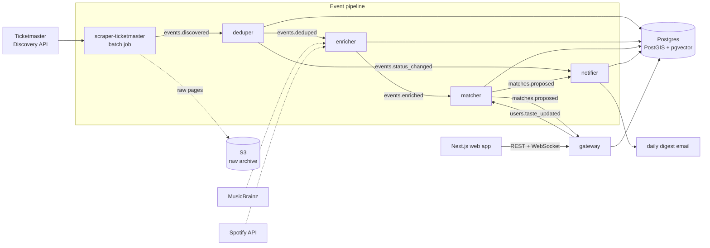
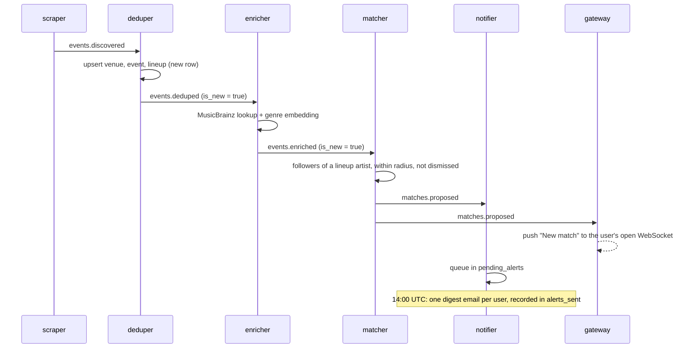
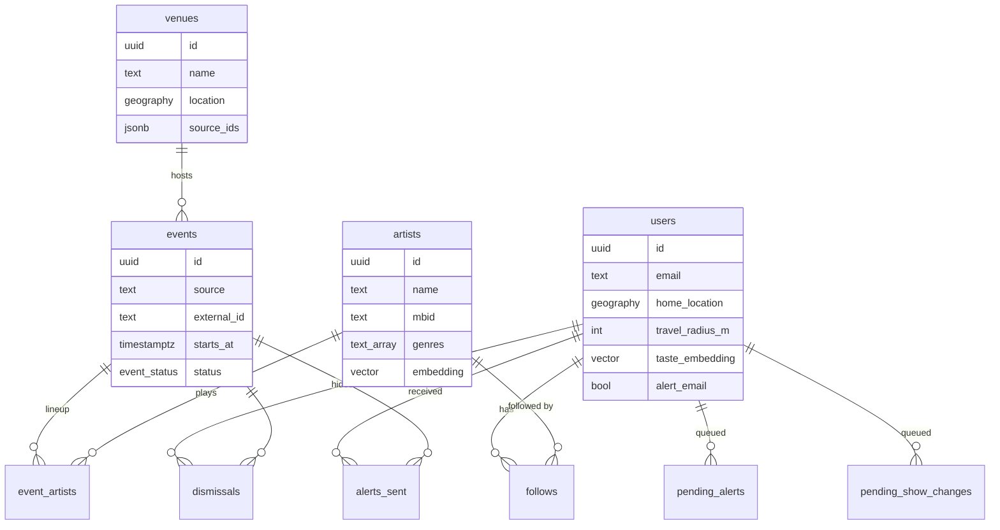
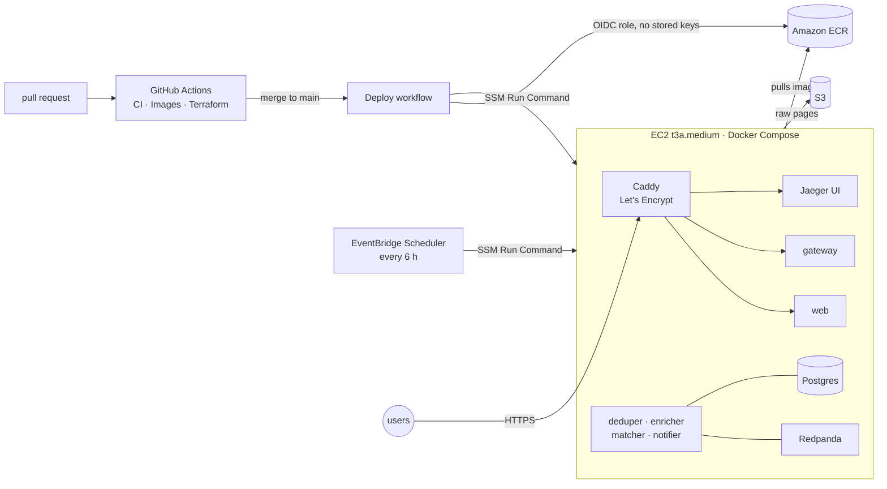

# Architecture

Concert Radar finds concerts near a user by artists they follow and ranks the rest by taste.
Six Python services cooperate through Kafka (Redpanda) topics and one Postgres database;
a Next.js app talks only to the gateway. Decisions behind this shape are in [`adr/`](adr/).

## System



| Service | What it does |
|---|---|
| `scraper-ticketmaster` | Batch job: pages through the Discovery API for one market (Columbus), archives each raw page to S3, publishes one `events.discovered` per show. |
| `deduper` | Upserts venues, events, and lineups idempotently; folds the same show listed by another source into one row (trigram title match, same venue, ±20 min, [ADR 004](adr/004-dedup-threshold.md)); publishes `events.deduped`, plus `events.status_changed` when a known show is cancelled or rescheduled. |
| `enricher` | Resolves each artist against MusicBrainz (1 req/s, retried on 503) and optionally Spotify, then embeds its genres with `all-MiniLM-L6-v2` (384 dimensions) so artists live in a shared taste space. |
| `matcher` | Decides who hears about what: a match needs an artist the user follows on the lineup of an upcoming show inside their radius ([ADR 006](adr/006-alert-rules.md)). Triggered by newly announced shows and by follows or home-area changes. |
| `notifier` | Queues matches and change notices, then sends one digest per user per day at 14:00 UTC. |
| `gateway` | FastAPI REST + WebSocket API: dev sign-in (JWT), ranked feed, search, follows, settings, event and artist pages, and a live push of new matches. |
| `web` | Next.js 14, TypeScript, Redux Toolkit: feed, clustered map, filters, event and artist pages, settings with a map picker. |

## Ranking

The feed scores every upcoming headliner show within the user's travel radius per request
([ADR 002](adr/002-direct-sql-feed.md)):

```
score = 0.7 × cosine_similarity(user taste, artist genres) + 0.3 × e^(−days until show / 30)
```

A user's taste vector is the average embedding of the artists they follow, recomputed on
every follow (`update_user_taste_embedding`); with no follows the score is a neutral 0.5.
Artist pages list the six nearest artists by the same embedding, served by an HNSW index.

## Event flows

A newly announced show reaching a fan:



A follow, a Spotify import, or a change of home location runs the same path from the gateway:
it publishes `users.taste_updated` with the artists to re-match, and the matcher proposes
those artists' upcoming nearby shows. Shows a user was already emailed about are skipped by
`alerts_sent`. If such a show is later cancelled, postponed, or rescheduled, the deduper's
`events.status_changed` queues a change notice for the next digest.

## Kafka topics

Messages are JSON validated by Pydantic models in each service
([ADR 007](adr/007-json-messages.md)); producers attach W3C `traceparent` headers.

| Topic | Key | Producer | Consumers |
|---|---|---|---|
| `events.discovered` | `source:external_id` | scraper | deduper |
| `events.deduped` | event id | deduper | enricher |
| `events.enriched` | event id | enricher | matcher |
| `events.status_changed` | event id | deduper | notifier |
| `users.taste_updated` | user id | gateway | matcher |
| `matches.proposed` | `user:event` | matcher | notifier, gateway (live push) |
| `notifications.sent` | `user:event` | notifier | (analytics; none yet) |

`scraping.page_fetched` and `notifications.requested` from the original topic plan are
created but unused: raw pages go straight to S3, and the matcher hands matches to the notifier
directly.

## Data model



Migrations are append-only SQL files applied by `db/migrate.sh`, which records each one in
`schema_migrations` and runs it in a single transaction.

## Deployment



Terraform (`infra/terraform`) creates the host, its IAM role, the ECR repositories, the S3
bucket, the GitHub OIDC deploy role, and the scraper schedule; there is no SSH (port 22 is
closed; operators use SSM). See [`deploy/README.md`](../deploy/README.md) and
[ADR 005](adr/005-single-host-compose.md).

## Reliability

- **Idempotent consumers.** Every write is an upsert or `ON CONFLICT DO NOTHING`, so replaying
  a message changes nothing. Offsets are committed after each message is handled.
- **Crash, don't guess.** A malformed message is logged and skipped so a partition never wedges;
  anything else (database down, an unexpected bug) crashes the consumer, which restarts and
  resumes from its last committed offset.
- **Polite upstreams.** MusicBrainz is throttled to 1 request/second and 503s are retried with
  backoff; Ticketmaster 429s are retried the same way.
- **Health.** Every long-running service serves `/healthz` and `/readyz` (database reachable,
  consumer started); the production stack waits on them during deploys.

## Observability

OpenTelemetry traces cross service and Kafka boundaries: producers inject the trace context
into message headers and consumers continue it, so one trace follows a show from the scrape
through to the matcher (or a follow from the HTTP request to the queued alert). Logs are JSON
from `structlog` with `trace_id`, `span_id`, and `service_name` on every line. Jaeger runs in
the stack; in production its UI is behind basic auth.

## Testing

- Python services: integration tests against real Postgres (the production image), Redpanda,
  and MinIO through testcontainers; HTTP calls to MusicBrainz, Spotify, and Ticketmaster go
  through `httpx` mock transports.
- Web: Vitest against the real Redux store and API client, with HTTP intercepted by MSW.
- CI runs ruff, `mypy --strict`, and every suite on each pull request, builds and smoke-tests
  every production image, and validates the Terraform; `main` only accepts green pull requests.
- `loadtest/feed.js` load-tests the feed with k6.

## Where this differs from the original spec

| Spec | Built | Why |
|---|---|---|
| Feed reads a materialized view | Direct SQL per request | [ADR 002](adr/002-direct-sql-feed.md) |
| Drizzle ORM in Next.js API routes | Web calls the gateway directly | [ADR 003](adr/003-gateway-is-the-api.md) |
| Kubernetes + Kustomize | One EC2 host, Docker Compose | [ADR 005](adr/005-single-host-compose.md) |
| Alerts above a score threshold, quiet hours | Followed artists only, daily digest | [ADR 006](adr/006-alert-rules.md) |
| Protobuf in `proto/` for every contract | JSON + Pydantic on Kafka | [ADR 007](adr/007-json-messages.md) |
| Mapbox GL JS | MapLibre GL with OpenStreetMap tiles | No API key or account needed |
| Ticketmaster DMA 249 | DMA 259 | 249 is Chicago; 259 is Columbus, OH |
| SES email | Logged email | SES sandbox only delivers to verified addresses |
| `postgis/postgis` + pgvector image | `pgvector/pgvector` + PostGIS | The bullseye-based PostGIS image no longer builds |
